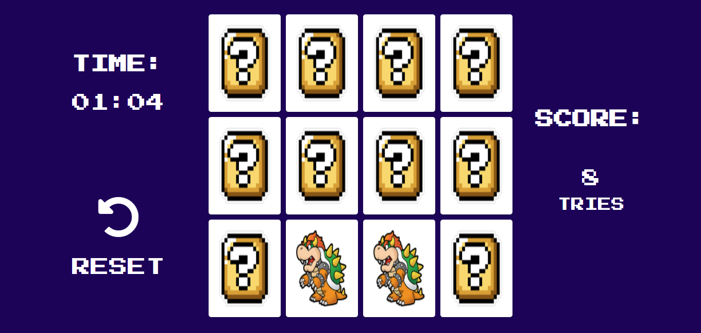
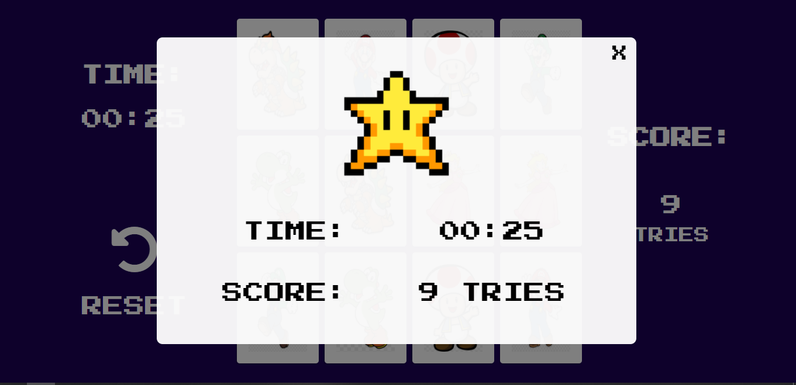

# Jogo da memória (projeto DIO)

Projeto desenvolvido durante Bootcamp da DIO (Digital Innovation One).

O projeto consiste em uma jogo da memória clássico. Acrescentei um botão para resetar o jogo, um contador de tempo e um placar marcando quantas tentativas foram feitas até terminar o jogo.
Projeto desenvolvido usando apenas HTML5, CSS3, JavaScript.

Para executar basta clonar o repositório e abrir o arquivo `index.html` no seu navegador.

## Screenshots :art:

